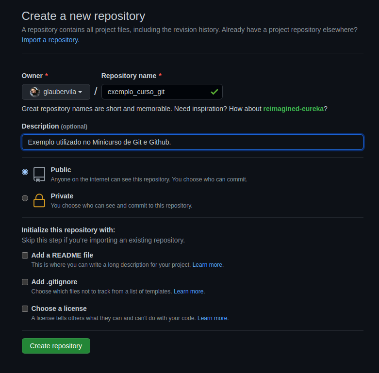
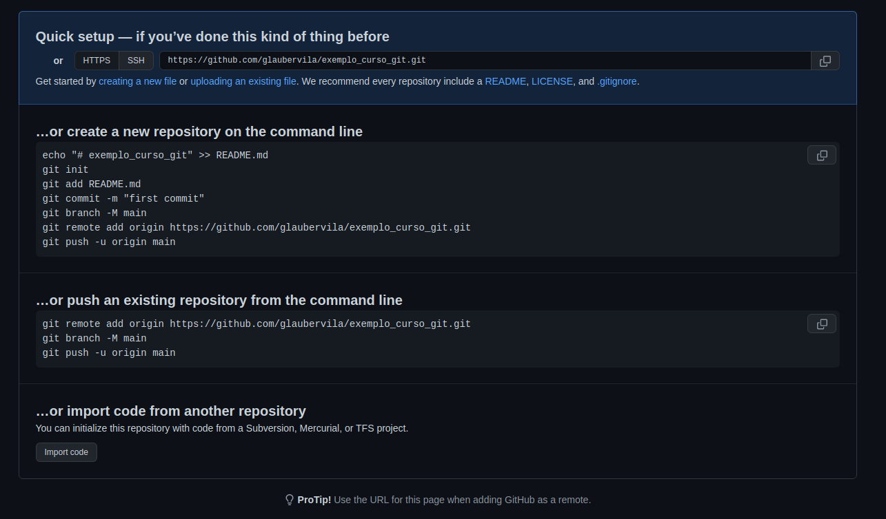

# Desenvolvimento Colaborativo com Git e GitHub

_________________

Este repositório é parte do mini curso oferecido pelo [LIneA](https://www.linea.gov.br/).

* [Desenvolvimento Colaborativo com Git e GitHub](#desenvolvimento-colaborativo-com-git-e-github)
  + [Objetivo](#objetivo)
  + [Pré requisitos](#pré-requisitos)
  + [Sobre Versionamento](#sobre-versionamento)
    - [Principais Vantagens](#principais-vantagens)
    - [Sobre o Git](#sobre-o-git)
    - [Sobre o GitHub](#sobre-o-github)
    - [O que é um Repositório](#o-que-é-um-repositório)
    - [O que é Branch](#o-que-é-branch)
    - [O que é Commit](#o-que-é-commit)
  + [Vamos a Prática](#vamos-a-prática)
    - [Git Init](#git-init)
    - [Git Status](#git-status)
    - [Git Add](#git-add)
    - [Git commit](#git-commit)
    - [Git log](#git-log)
    - [Git diff](#git-diff)
    - [Git checkout](#git-checkout)
    - [Git checkout para criar um novo branch](#git-checkout-para-criar-um-novo-branch)
    - [Git Merge](#git-merge)
  + [GitHub](#github)
    - [Git Pull](#git-pull)
    - [Git Push](#git-push)
    - [Exemplo usando Pull e Push](#exemplo-usando-pull-e-push)
    - [Git clone](#git-clone)
  + [Material de Apoio](#material-de-apoio)

<small><i><a href='http://ecotrust-canada.github.io/markdown-toc/'>Table of contents generated with markdown-toc</a></i></small>

## Objetivo

Introduzir o participante a conceitos básicos de versionamento de código e desenvolvimento colaborativo utilizando as principais ferramentas do mercado Git e Github. O curso vai apresentar os principais comandos utilizados no dia a dia. Espera-se que no final do curso o participante esteja apto a criar o seu próprio repositório ou colaborar com repositórios já existentes.

## Pré requisitos

* Ter previamente instalado o git, pode seguir este [Tutorial de Instalação](https://git-scm.com/book/pt-br/v2/Come%C3%A7ando-Instalando-o-Git).
* Ter uma conta no [GitHub](https://github.com/signup?ref_cta=Sign+up&ref_loc=header+logged+out&ref_page=%2F&source=header-home).
* Ter configurado usuário e senha do github no seu git, seguir este [tutorial](https://git-scm.com/book/pt-br/v2/Come%C3%A7ando-Configura%C3%A7%C3%A3o-Inicial-do-Git)

Para ajudar eu fiz um pequeno tutorial ensinando a instalar e configurar as credenciais. <https://www.youtube.com/watch?v=KNu75wZCjX0>

## Sobre Versionamento

Versionamento é o gerenciamento de versões diferentes de um documento qualquer. Não precisa ser código, pode ser arquivos texto e imagens por exemplo. O versionamento é controlado pelo o que chamamos de sistema de controle de versões. Normalmente, esses sistemas são utilizados no desenvolvimento de software para controlar as diferentes versões e histórico de desenvolvimento do código.

### Principais Vantagens

As principais vantagens de se utilizar um sistema de controle de versão para rastrear as alterações feitas durante o desenvolvimento de software ou o desenvolvimento de um documento de texto qualquer são:

* **Controle do histórico**: facilidade em desfazer e possibilidade de analisar o histórico do desenvolvimento, como também facilidade no resgate de versões mais antigas e estáveis. A maioria das implementações permitem analisar as alterações com detalhes, desde a primeira versão até a última.
* **Trabalho em equipe**: um sistema de controle de versão permite que diversas pessoas trabalhem sobre o mesmo conjunto de documentos ao mesmo tempo e minimiza o desgaste provocado por problemas com conflitos de edições.
* **Marcação e resgate de versões estáveis**: a maioria dos sistemas permite marcar onde é que o documento estava com uma versão estável, podendo ser facilmente resgatado no futuro.
* **Ramificação de projeto**: a maioria das implementações possibilita a divisão do projeto em várias linhas de desenvolvimento, que podem ser trabalhadas paralelamente, sem que uma interfira na outra.
* **Segurança**: Cada software de controle de versão usa mecanismos para evitar qualquer tipo de invasão de agentes infecciosos nos arquivos. Além do mais, somente usuários com permissão poderão mexer no código.
* **Rastreabilidade**: Com a necessidade de sabermos o local, o estado e a qualidade de um arquivo; o controle de versão traz todos esses requisitos de forma que o usuário possa se embasar do arquivo que deseja utilizar.
* **Organização**: Alguns softwares disponibilizam uma interface visual onde podem ser vistos todos os arquivos controlados, desde a origem até o projeto por completo.
* **Confiança**: O uso de repositórios remotos (na nuvem) ajuda a não perder arquivos por eventos inesperados. Além disso, e possível fazer novos projetos sem danificar o desenvolvimento do atual. [Fonte wikipedia](https://pt.wikipedia.org/wiki/Sistema_de_controle_de_vers%C3%B5es#Principais_vantagens)

### Sobre o Git

Git é um sistema de controle de versão distribuído, é gratuito e de código aberto projetado para lidar com tudo, desde projetos pequenos a muito grandes com velocidade e eficiência. [Página Oficial](https://git-scm.com/)

### Sobre o GitHub

GitHub é um serviço de hospedagem de repositórios Git. Enquanto o Git é uma ferramenta de linha de comando, o GitHub fornece uma interface gráfica baseada na web. Ele também fornece controle de acesso e vários recursos de colaboração, como wikis e ferramentas básicas de gerenciamento de tarefas para cada projeto. O GitHub também tem um aspecto de Rede Social ou comunidade de desenvolvedores. Onde qualquer um pode colaborar com projetos abertos.

### O que é um Repositório

Repositório, ou repo, é um diretório onde os arquivos do seu projeto ficam armazenados. Ele pode ser **local**, os arquivos ficam no seu computador ou **remoto** quando os arquivos ficam hospedados no GitHub por exemplo. Você pode armazenar códigos, imagens, áudios, ou qualquer outra coisa relacionada ao projeto no diretório.

### O que é Branch

Uma branch é literalmente uma ramificação da base do código.
Os repositórios funcionam como uma árvore, enquanto mantemos o código de produção na branch principal master/main por exemplo, podemos criar uma ramificação para trabalhar livremente neste código e somente depois juntar (mergear) estes códigos.

### O que é Commit

O commit captura o estado de um projeto naquele momento. os commits são simples e devem ser usados com frequência. pode conter uma funcionalidade completa ou apenas uma pequena modificação. no momento do commit essas mudanças existem apenas na ramificação onde o commit foi feito. essas mudanças podem ou não ser integradas a ramificação principal usando merge.

## Vamos a Prática

Neste Mini Curso vou mostrar dois caminhos para iniciarmos com o git, o primeiro é criar um repositório do zero e outro é utilizar um repositório já existente fazendo um Clone.

### Git Init

O comando git init cria um novo repositório do Git. Ele pode ser usado para converter um projeto existente e não versionado em um repositório do Git ou inicializar um novo repositório vazio

neste caso vamos iniciar com um diretório vazio que vai se chamar *curso_git*. dentro da pasta execute o comando:

```bash
git init
```


Feito isso o git vai mostar uma mensagem sugerindo que você mude o nome do branch default de master para main. Vamos seguir a recomendação e executar o seguinte comando:

```bash
git branch -m main
```

Pronto agora já temos nosso repositório com controle de versão, neste momento mesmo sem ter nenhum arquivo, uma estrutura com as informações do git foi criada no repositório no diretório oculto *.git*, não vamos alterar nada neste diretório, mas caso precise alterar alguma configuração do repositório vai ser no arquivo *.git/config*

Agora com o repositório criado precisamos entender como ele funciona.

### Git Status

Git status é o comando responsável por nos informar quais são os arquivos com alterações pendentes para serem adicionados a um commit.

Executando o comando abaixo temos a seguinte saída.

```bash
git status
```


O status nos informou que:

* Estamos trabalhando no Branch main.
* Não temos nenhum commit ainda.
* Não temos nenhum arquivo ou alteração para ser registrada.

Vamos criar um arquivo chamado README.md dentro do nosso repositório, escrever um titulo para nosso projeto e depois, executar o comando status novamente.


Perceba que agora temos um arquivo README.md no repositório que consta como não monitorado isso significa que apesar de estar dentro do repositório este arquivo ainda não está sendo controlado pelo git.  

Antes de adicionarmos este arquivo vamos entender quais estados um arquivo pode ter no repositório.


* Working directory - São os arquivos que estão no repositório mais ainda não foram adicionados, as mudanças nestes arquivos ainda não são monitoradas pelo git. estes arquivos não serão considerados quando o usuário realizar um commit.

* Staged/index - São arquivos já selecionados pelo usuário para fazerem parte do próximo commit que será executado.

### Git Add

Este comando serve para “adicionar conteúdo” (propor uma mudança qualquer, seja ela alterar, adicionar ou remover um conteúdo) de um arquivo local ao staging area, que terá a mudança confirmada, posteriormente, com o comando git commit, e finalmente enviada ao repositório remoto pelo git push.

Vamos adicionar nosso arquivo README.md com o seguinte comando:

```bash
git add README.md
```

Agora o git status nos mostra que nosso arquivo foi adicionado ao repositório, e está marcado para o proximo commit. após o commit qualquer mudança neste arquivo estará sendo monitorada.


Você pode ter mais informações sobre git add na [Documentação](https://git-scm.com/docs/git-add/pt_BR).

### Git commit

Grava as alterações feitas no repositório, Cria um novo commit que tenha todos os conteúdos atuais do índice e a mensagem informada no registro log descrevendo as alterações.

```bash
git commit -m "First Commit"
```

Neste comando o parametro -m representa a mensagem que vai descrever as alterações que foram feitas no repositório.


Mo resultado o git nos informa quantos arquivos foram modificados, quantas linhas foram alteradas e o short hash do commit *25b0aa6* que funciona como um ID único.

Mais informações na [Documentação](https://git-scm.com/docs/git-commit/pt_BR).

### Git log

O comando git log exibe um log com os commits feitos no repositório, o comando aceita uma serie de parametros para formatar as informações que serão exibidas. Para conhecer todos os parametros consulte a [Documentação](https://git-scm.com/docs/git-log/pt_BR)

Executando git log no nosso repositório neste momento temos esta saida

```bash
git log
```


* Commit: é o hash completo para este commit.
* Author: é o autor do commit, aqui serão usadas as informações cadastradas no git de usuario e email.
* Date: data e hora que o commit foi feito.
* Mensagem do commit, no nosso exemplo foi uma unica frase, mas pode ser um texto mais complexo com paragrados.

Vamos agora fazer umas alterações no nosso repositório, 
Vamos alterar o arquivo README.md, simplesmente abrir o arquivo e adicionar uma nova linha e depois criar um novo arquivo chamado GitComandos.md e por ultimo criar um arquivo vazio teste.txt

Depois dessas mudanças nosso repositório está assim:


Agora o status nos mostra que o aquivo README.md foi alterado e que temos dois novos arquivos que não estão sendo monitorados ainda.
Vamos adicionar esses arquivos novos arquivos.

```bash
git add GitComandos.md teste.txt
```


Note que só adicionei 2 arquivos, deixei o arquivo Modificado separado para mostrar mais alguns comandos são eles o git Diff e o Checkout.

### Git diff

Exibe as mudanças entre os commits, o commit, a árvore de trabalho, etc.
Este comando pode ser usado de varias formas, a mais simples delas serve para exibir as alterações feitas em relação ao índice (área de preparação para o próximo commit). Em outras palavras, as diferenças são as que você pode informar ao Git para adicionar ao índice, mas ainda não o fez. Você pode preparar essas alterações utilizando

```bash
git diff README.md
```


Neste caso o resultado é uma comparação entre o estado atual do arquivo e seu estado atual no branch. em quanto este arquivo não for adicionado com git add para o repositório vale a versão que já foi commit.

O simbolo + indica linhas que foram adicionadas ao arquivo, e - as linhas removidas. uma linha que foi alterada, será exibiba duas vezes uma com - (original) e a outra com + (alterada).

Neste ponto temos duas situações, as mudanças são desejadas queremos que elas façam parte do branch "add", ou por algum motivo precisamos voltar o arquivo para seu estado anterior "checkout".

Para mais informações do comando diff [Documentação](https://git-scm.com/docs/git-diff/pt_BR).

### Git checkout

Alterna entre os branchs ou restaura os arquivos da árvore de trabalho, atualiza os arquivos na árvore de trabalho para coincidir com a versão no índice ou na árvore informada.

Primeiro vamos ver como restaurar um arquivo ao seu estado anterior no branch. O comando checkout vai ser bastante utilizado no seu dia a dia, então recomendo uma passada pela [Documentação](https://git-scm.com/docs/git-checkout/pt_BR)

```bash
git checkout README.md
```


Repare que eu executei o checkout e em seguida fiz um status.
A saída do Status me mostra que o arquivo README.md não tem nenhuma alteração, ele não aparece mais na lista de modificados, está fora do staging e não será afetado pelo commit.

vamos fazer um commit destas mudanças

```bash
git commit -m "Foi adicionado um arquivo com varios comandos uteis do git."
```


Para exemplificar o uso do Checkout para mudar de branchs vamos remover o arquivo teste.txt do repositório, mas vamos fazer da seguinte forma.

* Criar um novo branch que vai conter apenas essa mudança.
* Remover o arquivo.
* Fazer um commit neste branch
* Fazer um Merge deste branch no branch master.

### Git checkout para criar um novo branch

Vamos criar um novo branch chamado remove_teste, para isso vamos usar o comando abaixo.

```bash
git checkout -b remove_teste
```

O parametro *-b* indica que estamos criando um novo branch *remove_teste* é o nome do branch. a partir de algora qualquer alteração que fizermos está acontecendo nesta ramificação do repositório e não afeta a branch master/main. podemos decidir se vamos querer essas modificações ou apenas abandonalas sem alterar o master.

o resultado do comando é este:


Neste momento a situação do nosso repositório é esta:


Em azul seria nossa branch Master/Main e em roxo nosso novo branch remove_teste. isso significa que as branchs são idenpendentes.

Agora que estamos em uma branch separada podemos fazer nossa alteração vamos remover o arquivo teste.txt com o comando:

```bash
rm teste.txt 
```


Após remover o arquivo, ao fazer um ` `  ` git status `  ` ` o git nos mostra que o arquivo foi removido. mas essa mudança ainda está no staged não foi commited ainda. vamos fazer git add e o commit.

```bash
git add teste.txt
git commit -m "Foi removido o arquivo teste.txt"
```

Lembrando que este commit só existe neste branch. vamos checar usando o comando *git log* que lista os commits.

```bash
git log
```


Agora que fizemos nossa alteração no branch remove_teste, vamos voltar ao branch Master/Main. para isso vamos usar o comando chekout.

```bash
git checkout main
```

Agora para ilustar que as modificações não existem no branch main, vamos executar o *git log*.


Repare que no branch Main não tem o commit que removeu o arquivo.
Isso por que as alterações feitas em um branch só são acessiveis em outro branch quando é feito um Merge. é o que vamos fazer agora

### Git Merge

Mesclagem é o jeito do Git de unificar um histórico bifurcado. O comando git merge permite que você pegue as linhas de desenvolvimento independentes criadas pelo git branch e as integre em uma ramificação única. Este comando tem muitas opções vale uma passada na [Documentação](https://git-scm.com/docs/git-merge) e também neste [Tutórial](https://git-scm.com/book/pt-br/v2/Branches-no-Git-O-b%C3%A1sico-de-Ramifica%C3%A7%C3%A3o-Branch-e-Mesclagem-Merge).

Agora vamos unificar as mudanças feitas no branch remove_teste com o branch Main. Primeiro passo é garantir que estamos no branch que vai receber as modificações, isso é feito com o *checkout*.

Estando no branch Main, vamos executar o comando merge que recebe como parametro o nome do branch com as modificações, o comando fica assim:

```bash
git merge remove_teste
```


Agora se executarmos o *git log* vamos ver que o branch Main agora possui o commit relacionado a remoção do arquivo teste.


O que aconteceu com nosso repósitorio está representado nesta imagem.


Tinhamos um ramo Master/Main, fizemos uma ramificação que é uma feature ou no nosso caso a remoção de um arquivo e depois aplicamos essa mudança na branch Main, repare que durante o desenvolvimento do branch remove_teste o branch Main continuou inalterado e é esse aspecto que garante a estabilidade.

Com esse conjunto de comandos e procedimentos encerramos o ciclo de manipulação de um repositório, basicamente isso é tudo que precisamos para se trabalhar em um projeto versionado com git.

Mas até agora tudo que fizemos está local na nossa maquina, vamos agora enviar esse repositório para um servidor remoto de git no caso o GitHub.

## GitHub

Primeiro passo é acessar o github com seu usuario e senha, e depois clicar em New, precisamos criar um repositório no servidor do GitHub, durante a criação podemos escolher se o repositório já existe ou se estamos criando um novo.


Após clicar em New temos essa tela:



Aqui vamos escolher o nome do nosso repositório, se ele é publico ou privado. e se o repositório vai ser iniciado pelo github ou não, no nosso vamos importar o nosso repositório, basta deixar os campos *Add a README file*, *Add .gitignore* e *Choose a license* vazios. e clicar em *Create a Repository*. pronto nosso repositório remoto está criado, e o github vai apresentar uma tela com sugestões de como configurar o repositório remoto no seu repo local.



Depois de criar o repositório o github vai sugerir algumas formas de iniciar o seu repositório, como nos já temos um repositório criado vamos usar a opção *Push an existing repository*.

```bash
git remote add origin https://github.com/glaubervila/exemplo_curso_git.git
git branch -M main
git push -u origin main
```

O primeiro comando é o remote add esse comando vai adicionar um origin remota ao repositório, nada mais é que o endereço deste repositório no servidor de git. Essa agora passa ser a origem deste repositório.

O comando branch -M main é para renomear seu branch master caso não tenha feito ainda.

O comando Push serve para enviar as mudanças locais para o servidor remoto.


Pronto agora nosso repositório local, tem uma copia hospedada no servidor remoto do github, podendo ser acessivel por qualquer pessoa e a partir de qualquer maquina.

Vamos acessar a página do nosso repositório no github, para ver como ficou. o caminho é mesmo endereço da origem sem *.git* do final: *<https://github.com/glaubervila/exemplo_curso_git>*


Explicando um pouco a página do repositório, temos no titulo o nome do repositório **exemplo_curso_git** e se é publico ou privado. A aba Code mostra qual branch estamos vendo e quantos branchs existem no servidor, abaixo temos os arquivos e pastas do projeto e caso seu projeto tenha um arquivo README.md ele será exibido na página principal do projeto.

É recomendado sempre ter este arquivo, é um arquivo texto escrito com a liguagem Markdown. O github fornece um editor de Markdown que ajuda quem não tem experiencia com esse tipo de marcação. No Readme é interessante ter uma explicação sobre o projeto, para que ele serve, exemplos de como instalar e utilizar.

Agora que nosso repositório está em um servidor remoto vamos adicionar dois comandos a nossa rotina. o Push e Pull.

### Git Pull

O comando git pull é usado para buscar e baixar conteúdo de repositórios remotos e fazer a atualização imediata ao repositório local para que os conteúdos sejam iguais. Fazer o merge de alterações upstream remotas no repositório local é algo comum em fluxos de trabalho de colaboração baseados em Git.

Vamos pensar na seguinte situação, o nosso projeto tem mais pessoas trabalhando nele, e antes que a gente começe uma nova feature vamos atualizar nosso projeto desta forma vamos ter a versão mais recente do nosso branch main.  

```bash
git pull origin main
```

*git pull* é para atualizar o branch local com as mudanças que estão no servidor remoto. *origin* se refere a Origem do servidor remoto, no caso quando fizemos o git add remote chamamos a url do repositório de origin. e *main* e qual branch remoto estamos trazendo para nosso branch local.


Neste caso não tinha nenhuma alteração, os 2 branchs local e remoto estão identicos.

### Git Push

O comando git push é usado para publicar modificações locais a um repositório remoto. Após um repositório local ter sido modificado, um comando push é executado para compartilhar as modificações com membros da equipe remota. [Documentação do git push](https://git-scm.com/docs/git-push/pt_BR)

Para exemplificar este comando, vou criar um arquivo qualquer, fazer um *git add*, depois *git commit*.

```bash
git push origin main 
```

*git push* envia as modificações *origin* indica para onde será enviado e *main* é qual branch local está sendo enviado.


### Exemplo usando Pull e Push

Para ficar mais claro o entendimente de todos os comando até aqui vamos fazer um ciclo completo que é bem proximo ao real no dia a dia.

Você precisa criar uma nova funcionalidade para seu projeto. As etapas seriam as seguintes:

* Estar no branch Main/Master `git checkout main`

* Atualizar o branch local com `git pull origin main`

* Criar um novo branch `git checkout -b new_feature`

* Alterar os arquivos necessários, nesta fase podem ser feitos quantos `git add` e `git commit` forem necessários. até que a feature esteja terminada.

* Atualizar o branch da feature com as modificações que podem ou não exisitir no Main remote. `git pull origin main` essa etapa ajuda a resolver possiveis conflitos caso o mesmo arquivo tenha sido alterado por 2 pessoas diferente.

* Fazer o merge do branch da feature com o seu branch main, local `git checkout main` e `git merge new_feature`.

* Por fim enviar a nova versão do seu branch main para o repositório remoto com `git push origin main`.

Este é apenas um exemplo de como um ciclo de desenvolvimento pode ser.

### Git clone

No começo da parte pratica eu falei de uma forma de se iniciar a trabalhar em um repositório já existente, essa forma é o clone.

O git clone é usado para copiar um repositório Git existente em um novo diretório local. A ação de clone do Git criará um novo diretório local para o repositório, copiará todo o conteúdo do repositório especificado, criará os branches rastreados remotos e fará o checkout de um branch inicial localmente.

Vamos usar o repositório de exemplo que criamos até aqui. Eu disponibilizei esse repositório no meu github e pode ser acessado neste link <https://github.com/glaubervila/exemplo_curso_git>, vamos supor que você quer colaborar de alguma forma para o projeto, nesse caso você vai precisar fazer um clone do repositório para sua maquina ficando com uma cópia local dele.


Na página do projeto basta clicar no botão code e copiar a endereço do repositório. no terminal vamos rodar o seguinte comando

```bash
git clone https://github.com/glaubervila/exemplo_curso_git.git
```


Pronto agora você tem uma cópia local do repositório, pode fazer um branch fazer alterações e depois solicitar um Pull Request no git hub.

Pull request é uma ação que não está descrita aqui, mas basicamente é você enviar o seu branch e pedir que ele seja adicionado ao branch main. os responsaveis pelo repositório que você clonou vão validar se é uma modificação valida ou relevante para o projeto e se for a sua colaboração passa a fazer parte do projeto. essa parte eu vou explicar na aula de forma interativa. vou adicionar o link da aula assim que estiver disponivel.

Para quem não assistiu a aula o minicurso acaba aqui.
Se você chegou até aqui espero que esse mini curso tenha te ajudado a entender sobre versionamento, para ajudar na sua jornada deixo abaixo alguns links que eu acho que podem ajudar.

Muito Obrigado e até mais!

## Material de Apoio

* [O que é Git E GitHub? - definição e conceitos importantes, por Rafaella Ballerini.](https://www.youtube.com/watch?v=DqTITcMq68k&ab_channel=RafaellaBallerini)
* [Como Usar Git E GitHub na Prática! - desde o primeiro commit até o pull request!, por Rafaella Ballerini.](https://www.youtube.com/watch?v=UBAX-13g8OM&ab_channel=RafaellaBallerini)
* [Como versionar utilizando o Git, por Raphael Batagini.](https://medium.com/biblioteca-dos-devs/como-versionar-utilizando-o-git-1f5d8fe2afcd)
